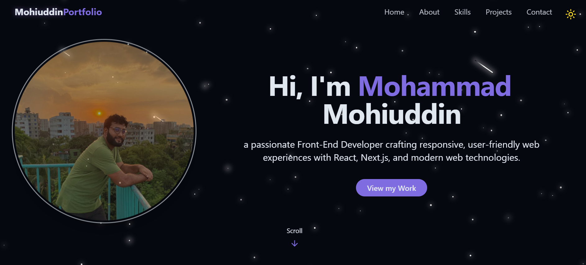
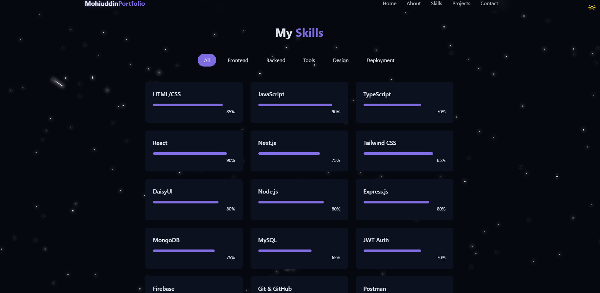
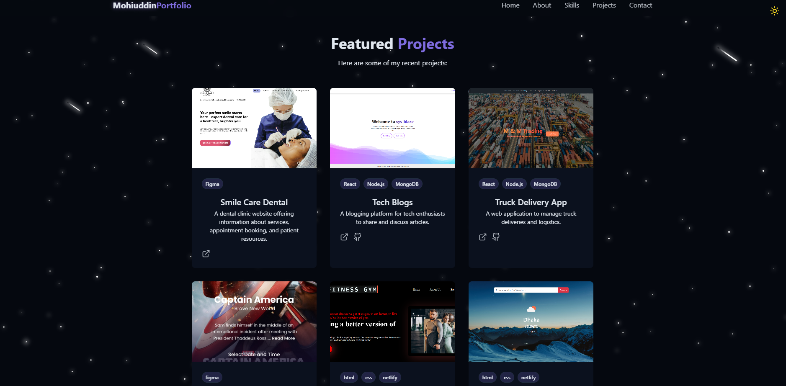
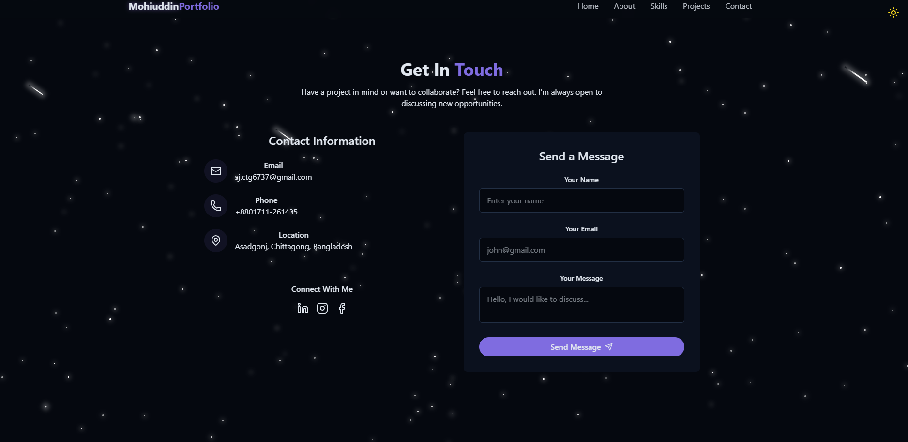

# 💼 Personal Portfolio Website

Welcome to my **personal portfolio website**! This project showcases my skills, projects, and contact information in a clean and responsive layout.

## 🌟 Features

- ✅ Fully responsive layout
- 🌙 Dark mode toggle
- 🧠 Skills section with progress indicators
- 🛠 Projects with live preview and GitHub links
- 📄 Downloadable resume button
- 📬 Contact form

---

## 🛠 Tech Stack

| Frontend | Styling      | Other          |
| -------- | ------------ | -------------- |
| React    | Tailwind CSS | React Router   |
| JSX      | DaisyUI      | Netlify Deploy |

---

## 📸 Screenshots

### 🔹 Homepage

### 🔹 Skills Section

### 🔹 Projects Section

### 🔹 Contact Section

---

## 🚀 Live Site

👉 [Visit Live Website](https://mohiuddin-ctg.netlify.app/)

---

## 📁 Folder Structure (Simplified)
